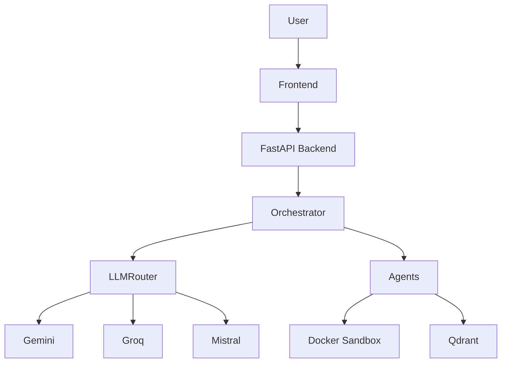

# System Architecture

NexusForge uses a multi-agent orchestrated architecture.

## Core Components
1. **Orchestrator**: Central coordinator that decomposes prompts into a DAG of tasks.
2. **LLM Router**: Multi-provider router with circuit breakers and fallback chains.
3. **Specialized Agents**: Domain-specific experts (Frontend, Backend, Database, Architecture, Debugger, Review).
4. **Project Memory**: RAG-based knowledge store using Qdrant.
5. **Execution Engine**: Parallel wave execution with dependency tracking.

